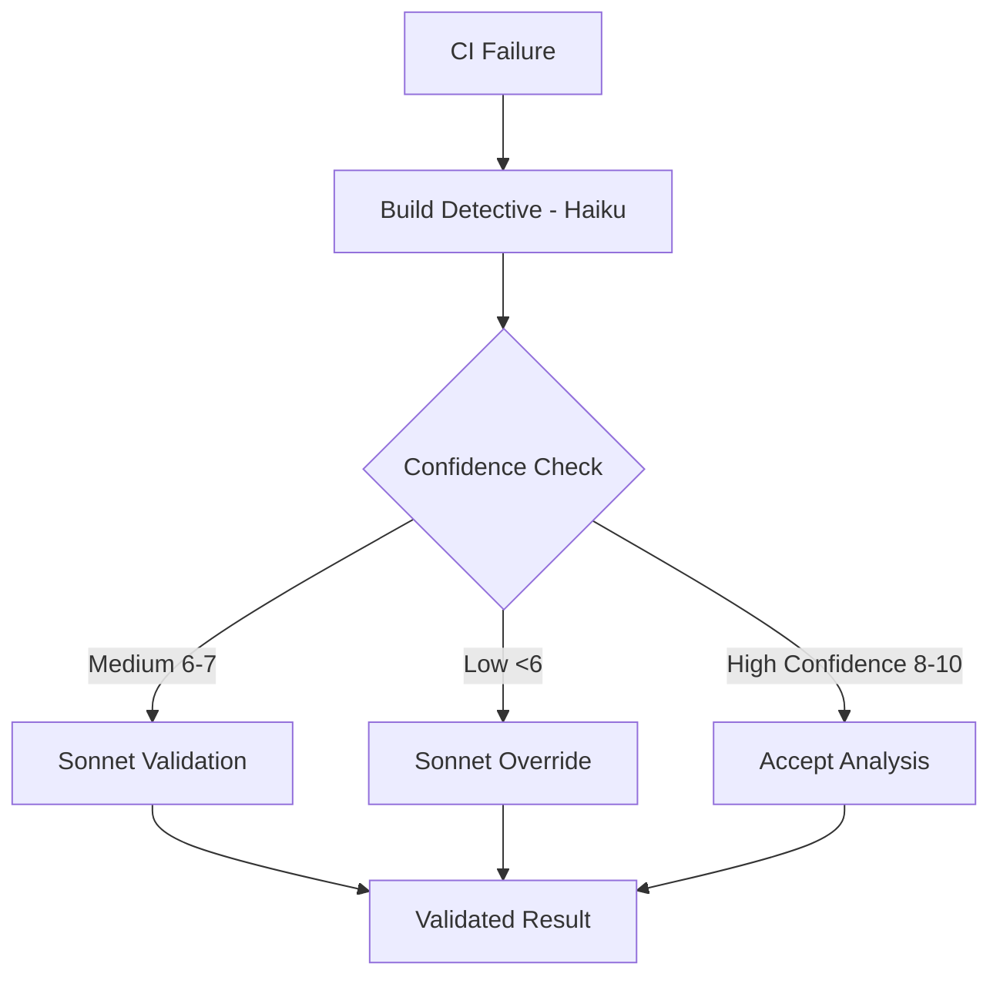

# 🕵️ Build Detective

AI slop <- yes I know, but at least its manually QC'ed :)

**AI-powered CI/build failure analysis for development teams**

```
    ██████╗ ██╗   ██╗██╗██╗     ██████╗     
    ██╔══██╗██║   ██║██║██║     ██╔══██╗    
    ██████╔╝██║   ██║██║██║     ██║  ██║    
    ██╔══██╗██║   ██║██║██║     ██║  ██║    
    ██████╔╝╚██████╔╝██║███████╗██████╔╝    
    ╚═════╝  ╚═════╝ ╚═╝╚══════╝╚═════╝     
                                            
    ██████╗ ███████╗████████╗███████╗ ██████╗████████╗██╗██╗   ██╗███████╗
    ██╔══██╗██╔════╝╚══██╔══╝██╔════╝██╔════╝╚══██╔══╝██║██║   ██║██╔════╝
    ██║  ██║█████╗     ██║   █████╗  ██║        ██║   ██║██║   ██║█████╗  
    ██║  ██║██╔══╝     ██║   ██╔══╝  ██║        ██║   ██║╚██╗ ██╔╝██╔══╝  
    ██████╔╝███████╗   ██║   ███████╗╚██████╗   ██║   ██║ ╚████╔╝ ███████╗
    ╚═════╝ ╚══════╝   ╚═╝   ╚══════╝ ╚═════╝   ╚═╝   ╚═╝  ╚═══╝  ╚══════╝
```

*The investigation never stops.* 🔍

Build Detective combines **Haiku's lightning-fast pattern recognition** with **Claude Sonnet's quality oversight** to deliver cost-effective CI failure analysis that development teams can trust.

## 🚀 Quick Start

```bash
# 1. Copy Build Detective to your project
./setup-build-detective.sh /path/to/your/project

# 2. Add to your CLAUDE.md
echo "- **CI/Build Analysis**: Use \`build-detective\` subagent for GitHub Actions failures" >> CLAUDE.md

# 3. Start investigating
"Use build-detective to investigate this build failure: https://github.com/user/repo/actions/runs/12345"
```

## 🎯 The Problem We Solve

**Before Build Detective:**
- 3000+ tokens per CI analysis 💸
- 2-5 minutes waiting for diagnosis ⏰
- Expensive Sonnet analysis for routine failures 📈

**With Build Detective:**
- 400-800 tokens (85% cost reduction) 💰
- 10-30 seconds for common patterns ⚡
- Quality assurance prevents wrong analysis ✅
- Scales across unlimited projects 🚀

## ⚙️ How It Works

### Two-Tier AI Architecture



1. **Build Detective (Haiku)** - Fast pattern recognition specialist
2. **Sonnet Oversight** - Quality validator and complex scenario handler
3. **User** - Receives validated, actionable analysis

### Quality Assurance System

Automatic escalation triggers prevent Build Detective from providing misleading analysis:

- ❌ **Technology Stack Mismatch**: Java error in Python project
- ❌ **Low Confidence**: <7/10 confidence score
- ❌ **Generic Solutions**: "Check configuration" responses
- ❌ **Context Contradictions**: Test failure when build never compiled

## 📊 Pattern Recognition Library

### High Success Rate (90%+)
- Docker COPY missing file patterns
- Java version mismatches in CI
- Maven plugin execution failures
- Git submodule configuration errors

### Medium Success Rate (80-90%)
- Dependency version conflicts
- Port binding issues
- Memory allocation failures
- Authentication problems

### Escalated to Sonnet (Complex cases)
- Multi-system integration failures
- Custom build configurations
- Performance-related issues
- First-time setup problems

## 🛠️ Features

### ⚡ **Lightning Fast Analysis**
- 400-800 tokens vs 3000+ (85% cost reduction)
- 10-30 second response time
- Bulk analysis across multiple CI runs

### 🎯 **GitHub CLI Integration**
- Bypasses expired GitHub Actions URLs
- Handles log truncation (web interface ~10KB limit)
- Complete log access for accurate analysis
- Cross-repository support

### 🔍 **Advanced Pattern Matching**
- Maven compilation errors
- Docker build failures
- GitHub Actions setup issues
- Git submodule problems
- Dependency conflicts

### 🛡️ **Quality Assurance**
- Automatic validation of BD analysis
- Confidence-based escalation
- Technology stack verification
- Solution feasibility checks

## 📁 Project Structure

```
build-detective/
├── 📖 docs/
│   ├── 🏗️ setup/          # Installation and setup guides
│   ├── 📚 guides/          # Usage and integration guides  
│   ├── 🔧 troubleshooting/ # Common issues and solutions
│   └── 🧠 architecture/    # Technical implementation details
├── 📋 templates/           # Agent templates for different project types
├── 🔧 scripts/            # Setup and utility scripts
├── 📊 examples/           # Real-world usage examples
└── 🧪 tests/              # Quality assurance tests
```

## 📖 Documentation

### 🚀 Getting Started
- [Quick Start Guide](docs/setup/QUICK_START.md) - Get up and running in 5 minutes
- [Installation Guide](docs/setup/INSTALLATION.md) - Detailed setup instructions
- [Integration Guide](docs/setup/INTEGRATION.md) - Team workflow integration

### 📚 Usage Guides  
- [Command Patterns](docs/guides/COMMAND_PATTERNS.md) - How to talk to Build Detective
- [Quality Control](docs/guides/QUALITY_CONTROL.md) - Understanding validation and escalation
- [GitHub CLI Integration](docs/guides/GITHUB_CLI.md) - Advanced log analysis techniques

### 🔧 Advanced Topics
- [Architecture Overview](docs/architecture/OVERVIEW.md) - Two-tier AI system design
- [Pattern Library](docs/architecture/PATTERNS.md) - Complete error pattern database
- [Multi-Project Deployment](docs/guides/MULTI_PROJECT.md) - Organization-wide rollout

## 🎨 Usage Examples

### Single Build Analysis
```bash
"Use build-detective to investigate this GitHub Actions failure: 
https://github.com/user/repo/actions/runs/12345"
```

### Technology-Specific Analysis
```bash
"BD maven dependency conflict"
"BD docker build failed - COPY instruction"  
"BD git submodule initialization failure"
```

### Bulk Pattern Analysis
```bash
"BD analyze last 10 CI failures for recurring patterns"
"BD check failure trends over past week"
```

## 🏆 Success Metrics

### Quality Indicators
- **BD Accuracy Rate**: >90% for confidence >8
- **False Positive Rate**: <5% on high-confidence analyses
- **Escalation Precision**: Sonnet correctly identifies BD errors >95%
- **Time to Resolution**: BD + validation <2 minutes average

### Cost Efficiency
- **Token Reduction**: 85% vs full Sonnet analysis
- **Speed Improvement**: 10x faster initial diagnosis
- **Scalability**: Unlimited projects with template system

## 🤝 Contributing

We welcome contributions! Please see our [Contributing Guide](CONTRIBUTING.md) for details.

### Development Setup
```bash
git clone https://github.com/StigLau/build-detective.git
cd build-detective
./scripts/test-setup.sh
```

### Areas for Contribution
- 🎯 **Pattern Library**: Add new error patterns and solutions
- 🧪 **Quality Tests**: Improve validation accuracy
- 📚 **Documentation**: Usage examples and guides
- 🔧 **Templates**: Support for new technology stacks

## 📄 License

MIT License - see [LICENSE](LICENSE) for details.

## 🙏 Acknowledgments

- **Claude Haiku** - Fast, cost-effective pattern recognition
- **Claude Sonnet** - Quality oversight and complex reasoning
- **GitHub CLI** - Reliable log access and CI integration
- **Development Community** - Real-world usage patterns and feedback

## 🔗 Related Projects

- [MCP FFMPEG](https://github.com/StigLau/yolo-ffmpeg-mcp) - Where Build Detective was born
- [Claude Code](https://claude.ai/code) - The AI development environment
- [GitHub CLI](https://cli.github.com/) - Essential tool for CI analysis

---

*Build Detective: Because every CI failure tells a story, and we're here to solve the mystery.* 🕵️‍♀️

[](https://github.com/StigLau/build-detective)
[](https://opensource.org/licenses/MIT)
[](http://makeapullrequest.com)
