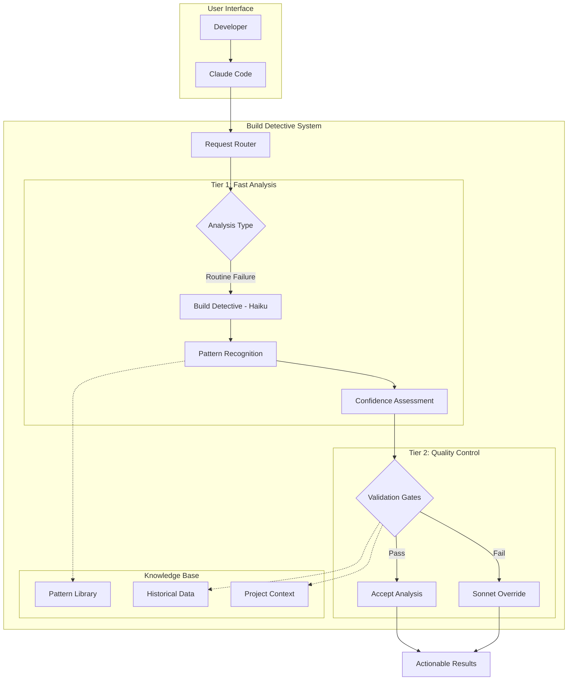

# 🏗️ Architecture Overview

Understanding Build Detective's two-tier AI system and quality assurance mechanisms.

## System Architecture



## Design Principles

### 🎯 **Cost-Effective Specialization**
- **Haiku for patterns** - Fast, cheap recognition of common issues
- **Sonnet for reasoning** - Complex analysis and quality validation
- **Human for edge cases** - Unseen scenarios and architectural decisions

### ⚡ **Speed Without Sacrificing Quality**
- **10-30 second response** for 80% of common CI failures
- **Quality gates** prevent wrong analysis from reaching users
- **Escalation triggers** ensure complex cases get proper attention

### 🔄 **Learning and Improvement**
- **Pattern library evolution** based on real-world usage
- **Feedback integration** to improve accuracy over time
- **Cross-project knowledge** sharing through templates

## Component Deep Dive

### Tier 1: Build Detective (Haiku)

**Role**: Pattern recognition specialist
**Strengths**:
- Lightning-fast error classification
- Cost-effective bulk analysis
- Structured JSON output
- Technology stack identification

**Technical Capabilities**:
```python
def analyze_failure(log_content, project_context):
    """
    Haiku-powered analysis optimized for:
    - Token efficiency (400-800 vs 3000+)
    - Pattern matching accuracy (85%+ for known patterns)
    - Structured response format
    - Technology-specific expertise
    """
    return {
        "confidence": 8,
        "error_type": "compilation",
        "primary_error": "Specific blocking issue",
        "suggested_action": "Actionable solution"
    }
```

**Pattern Library Coverage**:
- **Maven/Gradle**: Plugin failures, dependency conflicts
- **Docker**: Build failures, COPY issues, layer problems
- **GitHub Actions**: Setup failures, artifact issues, timeouts
- **Git**: Submodule errors, authentication, merge conflicts
- **Java**: Version mismatches, compilation errors

### Tier 2: Sonnet Oversight

**Role**: Quality validator and complex reasoner
**Responsibilities**:
- Validate BD analysis for correctness
- Handle complex multi-system failures
- Provide additional context and reasoning
- Learn from BD mistakes

**Validation Framework**:
```python
def validate_bd_analysis(bd_result, context):
    """
    Sonnet validation checks:
    1. Confidence alignment with complexity
    2. Technology stack verification
    3. Solution feasibility assessment
    4. Context contradiction detection
    """
    
    validation_flags = []
    
    # Confidence sanity check
    if bd_result["confidence"] < 7:
        validation_flags.append("LOW_CONFIDENCE")
    
    # Technology alignment
    if tech_stack_mismatch(bd_result, context):
        validation_flags.append("TECH_MISMATCH")
    
    # Solution specificity
    if is_generic_solution(bd_result["suggested_action"]):
        validation_flags.append("GENERIC_SOLUTION")
    
    return ValidationResult(
        escalate=len(validation_flags) > 0,
        flags=validation_flags
    )
```

## Quality Assurance System

### Automatic Escalation Triggers

#### 1. **Confidence Score Validation**
```python
ESCALATION_RULES = {
    "suspiciously_perfect": lambda c: c == 10,  # Perfect confidence is suspicious
    "too_uncertain": lambda c: c < 7,           # Uncertain analysis needs human
    "overconfident_complex": lambda c, complexity: c > 8 and complexity == "high"
}
```

#### 2. **Technology Stack Alignment**
```python
def check_technology_alignment(bd_result, project):
    """Ensure BD's analysis matches project reality"""
    if bd_result["error_type"] == "java" and not project.has_java_files():
        return ValidationFlag("TECH_MISMATCH")
    
    if bd_result["error_type"] == "maven" and not project.has_pom_xml():
        return ValidationFlag("TECH_MISMATCH") 
```

#### 3. **Solution Feasibility Assessment**
```python
def validate_solution_feasibility(solution, project_constraints):
    """Check if suggested solution is actually implementable"""
    if "update dependency" in solution and project.has_version_locks():
        return ValidationFlag("CONSTRAINT_VIOLATION")
    
    if "add configuration" in solution and project.is_readonly():
        return ValidationFlag("READONLY_CONFLICT")
```

### Decision Matrix

| BD Confidence | Context Complexity | Sonnet Action | Time Investment |
|---------------|-------------------|---------------|-----------------|
| 8-10 + Simple | Low | Quick validation (30s) | Minimal overhead |
| 8-10 + Complex | High | Deep review (2-3min) | Thorough check |
| 6-7 | Any | Manual analysis (5min) | Quality assurance |
| <6 | Any | Full override (10min) | Complete takeover |

## Performance Characteristics

### Token Economics
```
Traditional Sonnet Analysis:
- Input: 2000-4000 tokens (full log analysis)
- Processing: Complex reasoning
- Output: 500-1000 tokens
- Total: 3000-5000 tokens

Build Detective + Validation:
- BD Analysis: 400-800 tokens
- Sonnet Validation: 200-400 tokens (if needed)
- Total: 600-1200 tokens (80% reduction)
```

### Accuracy Metrics
- **High Confidence Patterns (8-10)**: 90%+ accuracy
- **Medium Confidence (6-7)**: 80-85% accuracy with validation
- **Low Confidence (<6)**: 100% escalated to Sonnet
- **False Positive Rate**: <5% after validation

### Speed Benchmarks
- **BD Pattern Recognition**: 10-30 seconds
- **Sonnet Quick Validation**: 30 seconds additional
- **Sonnet Deep Review**: 2-3 minutes additional
- **Full Sonnet Override**: 5-10 minutes

## Scalability Architecture

### Template-Based Deployment
```
Organization Level:
├── Central Pattern Library
├── Quality Validation Rules
└── Deployment Templates

Project Level:
├── Customized BD Agent
├── Project-Specific Patterns
└── Local Configuration
```

### Cross-Project Learning
```python
def update_global_patterns(project_feedback):
    """
    Feedback from individual projects improves
    the global pattern library for all users
    """
    if feedback.pattern_success_rate < 0.8:
        global_library.flag_pattern_for_review(feedback.pattern_id)
    
    if feedback.new_pattern_discovered:
        global_library.add_candidate_pattern(feedback.pattern)
```

## Integration Points

### Claude Code Integration
```markdown
### Subagent Delegation Strategy
- **CI/Build Analysis**: Use `build-detective` subagent
- **Quality Validation**: Automatic Sonnet oversight
- **Escalation**: Complex scenarios → full Sonnet analysis
```

### GitHub CLI Integration
```bash
# BD leverages GitHub CLI for:
gh run view <run-id> --log              # Complete log access
gh run list --status failure --json     # Bulk analysis data
gh workflow list --repo <repo>          # Workflow context
```

### Project Template System
```yaml
# Template variables for project customization
project_name: "{{PROJECT_NAME}}"
primary_language: "{{PRIMARY_LANGUAGE}}"
build_system: "{{BUILD_SYSTEM}}"
common_patterns:
  - pattern: "{{COMMON_ISSUE_1}}"
    solution: "{{TYPICAL_SOLUTION_1}}"
```

## Future Enhancements

### Pattern Library Evolution
- **Machine learning** on pattern success rates
- **Community contributions** to pattern database
- **Industry-specific** pattern libraries

### Quality System Improvements
- **Automated testing** of BD accuracy
- **A/B testing** of validation rules
- **User feedback** integration loops

### Integration Expansion
- **IDE plugins** for local build analysis
- **Slack/Teams** bots for team notifications
- **Metrics dashboards** for CI health monitoring

---

*This architecture enables Build Detective to be fast, accurate, and continuously improving while maintaining the quality standards development teams need.* 🏗️