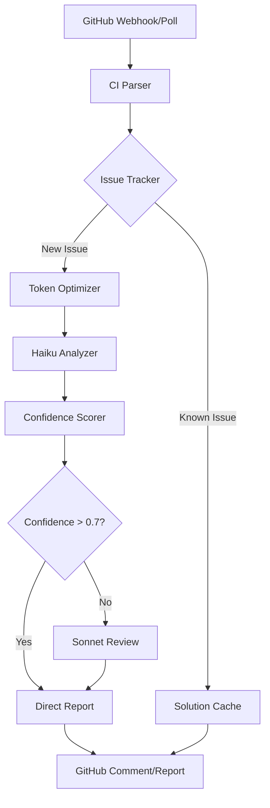

# Build Detective Architecture

## System Design Philosophy

Build Detective follows a multi-tier architecture optimized for cost-efficiency and accuracy:

1. **Orchestration Layer** (Claude Sonnet) - High-level decision making and quality control
2. **Analysis Layer** (Claude Haiku) - Rapid, cost-effective failure analysis
3. **Data Layer** (SQLite + File Cache) - Pattern recognition and deduplication

## Component Specifications

### 1. Orchestrator (Claude Sonnet)

**Responsibilities:**
- Task planning and delegation
- Quality control of Haiku's analysis
- Agent self-improvement
- Complex pattern correlation

**Implementation:** `src/orchestrator/supervisor.py`

```python
class Supervisor:
    """
    Main orchestration component using Claude Sonnet.
    Manages the entire analysis pipeline.
    """
    
    def plan_analysis(self, failures: List[CIFailure]) -> AnalysisPlan
    def review_results(self, analysis: AnalysisResult) -> QCResult
    def suggest_improvements(self) -> List[Improvement]
    def handle_edge_cases(self, complex_failure: CIFailure) -> Resolution
```

### 2. GitHub Integration

**Components:**

#### CI Parser (`src/github_integration/ci_parser.py`)
```python
class CIParser:
    """
    Parses different CI/CD system outputs.
    Supports: GitHub Actions, CircleCI, Jenkins, Travis CI
    """
    
    def parse_github_actions(self, workflow_run: dict) -> CIResult
    def parse_circleci(self, build_data: dict) -> CIResult
    def extract_test_failures(self, logs: str) -> List[TestFailure]
    def normalize_error_messages(self, raw_error: str) -> str
```

#### GitHub Client (`src/github_integration/client.py`)
```python
class GitHubClient:
    """
    Handles GitHub API interactions with rate limiting.
    """
    
    def get_workflow_runs(self, repo: str, status: str = "failure") -> List[WorkflowRun]
    def get_job_logs(self, repo: str, job_id: int) -> str
    def get_pull_request_context(self, repo: str, pr_number: int) -> PRContext
    def post_comment(self, repo: str, issue_number: int, analysis: str) -> None
```

### 3. Analysis Engine

**Failure Analyzer (`src/analysis/failure_analyzer.py`)**

```python
class FailureAnalyzer:
    """
    Core analysis engine using Claude Haiku.
    Optimized for token efficiency.
    """
    
    def analyze_failure(self, failure: TestFailure) -> Analysis:
        # 1. Check cache for similar failures
        # 2. Compress logs to essential information
        # 3. Send to Haiku with minimal context
        # 4. Parse structured response
        
    def batch_analyze(self, failures: List[TestFailure]) -> List[Analysis]:
        # Group similar failures
        # Single Haiku call for batch
        # Distribute results
```

**Pattern Matcher (`src/analysis/pattern_matcher.py`)**

```python
class PatternMatcher:
    """
    Identifies common failure patterns without LLM calls.
    """
    
    PATTERNS = {
        "null_pointer": r"NullPointerException|NPE|null reference",
        "timeout": r"timeout|timed out|deadline exceeded",
        "connection": r"connection refused|ECONNREFUSED|unable to connect",
        "permission": r"permission denied|access denied|unauthorized",
        "memory": r"OutOfMemoryError|heap space|memory limit",
        "compilation": r"compilation failed|syntax error|cannot find symbol",
        "assertion": r"assertion failed|expected.*but was|assert",
        "dependency": r"cannot resolve|dependency not found|module not found"
    }
    
    def match_pattern(self, error_text: str) -> Optional[str]
    def extract_key_variables(self, error_text: str) -> dict
```

### 4. Issue Tracker

**Database Schema (`src/issue_tracker/database.py`)**

```python
class IssueDatabase:
    """
    SQLite-based issue tracking with deduplication.
    """
    
    def __init__(self, db_path: str = "data/issues.db"):
        self.init_database()
    
    def record_issue(self, issue: Issue) -> int
    def find_similar_issues(self, issue: Issue, threshold: float = 0.8) -> List[Issue]
    def get_solution_if_exists(self, error_signature: str) -> Optional[Solution]
    def update_solution_effectiveness(self, solution_id: int, worked: bool) -> None
```

**Deduplicator (`src/issue_tracker/deduplicator.py`)**

```python
class Deduplicator:
    """
    Prevents redundant analysis using similarity hashing.
    """
    
    def generate_signature(self, failure: TestFailure) -> str:
        # Create hash from:
        # - Error type
        # - Key stack frames
        # - Test name pattern
        
    def is_duplicate(self, signature: str, time_window: int = 3600) -> bool
    def merge_duplicate_insights(self, analyses: List[Analysis]) -> Analysis
```

### 5. Token Optimizer

**Implementation (`src/utils/token_optimizer.py`)**

```python
class TokenOptimizer:
    """
    Minimizes token usage while preserving information.
    """
    
    def compress_logs(self, logs: str, max_tokens: int = 500) -> str:
        # 1. Extract stack traces
        # 2. Remove timestamps
        # 3. Deduplicate repeated lines
        # 4. Focus on error vicinity (±10 lines)
        
    def estimate_tokens(self, text: str) -> int:
        # Rough estimation: ~4 chars per token
        
    def batch_for_efficiency(self, items: List[str], max_batch_tokens: int = 1000) -> List[List[str]]
```

## Data Flow



## Cost Optimization Strategies

### 1. Tiered Analysis
- **Level 1**: Pattern matching (no LLM)
- **Level 2**: Haiku analysis (low cost)
- **Level 3**: Sonnet review (selective)

### 2. Caching Strategy
```python
CACHE_RULES = {
    "exact_match": 7200,      # 2 hours
    "similar_match": 3600,    # 1 hour  
    "pattern_match": 1800,    # 30 minutes
    "llm_analysis": 900       # 15 minutes
}
```

### 3. Batching Logic
- Group failures by repository
- Combine similar error types
- Maximum 5 failures per Haiku call
- Aggregate reports hourly

### 4. Progressive Enhancement
1. Start with cached solution
2. Apply pattern matching
3. Use Haiku for unknowns
4. Escalate to Sonnet only for:
   - Low confidence results
   - Complex multi-system failures
   - New error patterns

## Performance Targets

| Metric | Target | Current |
|--------|--------|---------|
| Analysis Speed | < 5s per failure | - |
| Token Usage (Haiku) | < 500 per analysis | - |
| Token Usage (Sonnet) | < 100 per review | - |
| Cache Hit Rate | > 60% | - |
| Deduplication Rate | > 40% | - |
| Confidence Accuracy | > 80% | - |
| False Positive Rate | < 10% | - |

## Monitoring & Observability

### Metrics to Track
```python
METRICS = {
    "token_usage": {
        "haiku_daily": 0,
        "sonnet_daily": 0,
        "cost_estimate": 0.0
    },
    "performance": {
        "analyses_per_hour": 0,
        "avg_response_time": 0.0,
        "cache_hit_rate": 0.0
    },
    "accuracy": {
        "true_positives": 0,
        "false_positives": 0,
        "confidence_correlation": 0.0
    }
}
```

### Logging Strategy
- **INFO**: Analysis summaries, cache hits
- **DEBUG**: Token counts, API calls
- **WARNING**: Low confidence, rate limits
- **ERROR**: API failures, parsing errors

## Security Considerations

1. **API Keys**: Environment variables only
2. **Log Sanitization**: Remove secrets/tokens
3. **GitHub Permissions**: Read-only by default
4. **Database**: Local SQLite, no external access
5. **Webhook Validation**: HMAC signature verification
